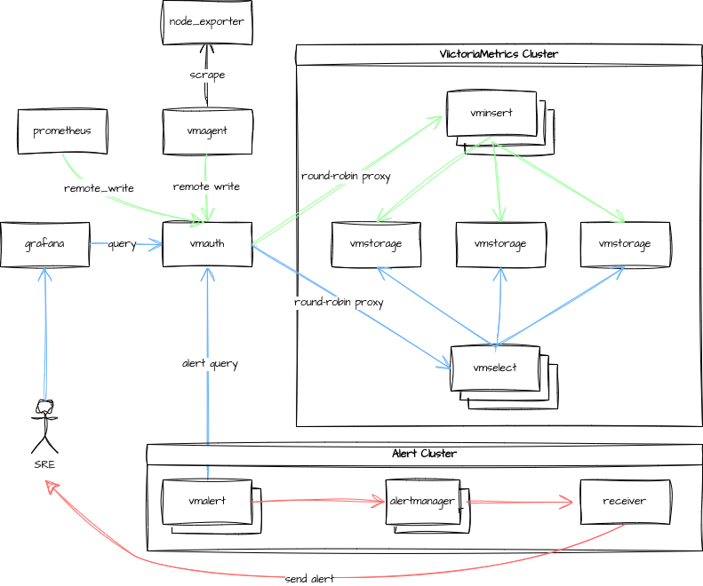

Vagrant for VictoriaMetrics Cluster
========

## Introduction



Vagrant project spin up a single virtual machine running:

- node_exporter
- prometheus
- alertmanager
- victoriametrics cluster
- grafana with victoriametrics datasource plugin

## Version Information

The versions of the above components that the VM is provisioned with are defined in the file `scripts/versions.sh`

The following version combinations are known to work: -

- node_exporter 1.7.0
- prometheus 2.16.0
- alertmanager 0.20.0
- victoriametrics 1.90.0
- grafana 9.2.7
- grafana victoriametrics datasource plugin 0.1.3

## Services

The virtual machine will be running the following services:

- node_exporter * 1
- prometheus * 1
- alertmanager * 2
- alert receiver service * 1
- grafana * 1
- vmstorage * 3
- vminsert * 3
- vmselect * 3
- vmauth * 1
- vmalert * 2

## Getting Started

1. Download and install [VirtualBox](https://www.virtualbox.org/wiki/Downloads).
2. Download and install [Vagrant](http://www.vagrantup.com/downloads.html).
3. Clone this repo.
4. In your terminal change your directory into the project directory (i.e. `cd vagrant-victoriametrics`).
5. Check the `scripts/versions.sh` file for the versions of the components.
6. Run `vagrant up` to create the VM using virtualbox as a provider.(**NOTE** *This will take a while the first time as many dependencies are downloaded - subsequent deployments will be quicker as dependencies are cached in the `resources` directory*).
7. Execute `vagrant ssh` to login to the VM.

## Web user interfaces

Here are some useful links to navigate to various UI's:

- prometheus: (http://node:9090)
- alertmanager: (http://node:9093 & http://node:9094)
- vmalert: (http://node:8880 & http://node:8881)
- vmui: (http://node:8481/select/0/prometheus/vmui & http://node:8581/select/0/prometheus/vmui & http://node:8681/select/0/prometheus/vmui)
- grafana: (http://node:3000)

The default ip address of the virtualbox machine should be `192.168.56.10`, substitute the ip address for `node` if necessary.

## Shared Folder

Vagrant automatically mounts the folder containing the Vagrant file from the host machine into the guest machine as `/vagrant` inside the guest.

## Managment of Vagrant VM

To stop the VM and preserve all setup/data within the VM:

```
vagrant halt
```

or

```
vagrant suspend
```

Issue a `vagrant up` command again to restart the VM from where you left off.

To completely **wipe** the VM so that `vagrant up` command gives you a fresh machine:

```
vagrant destroy
```

Then issue `vagrant up` command as usual.

## Thanks

This project draws on the code structure of [vagrant-hadoop-hive-spark](https://github.com/martinprobson/vagrant-hadoop-hive-spark.git) repository.
